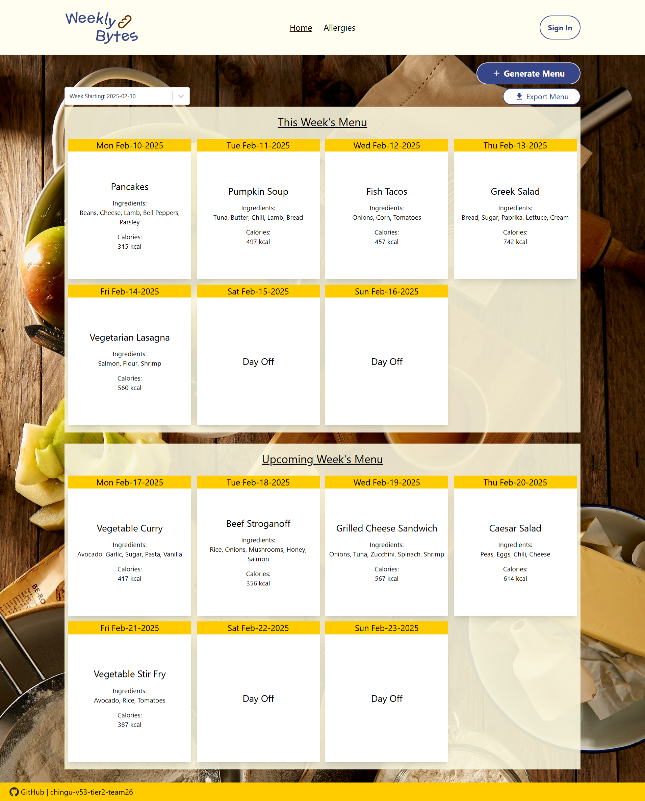
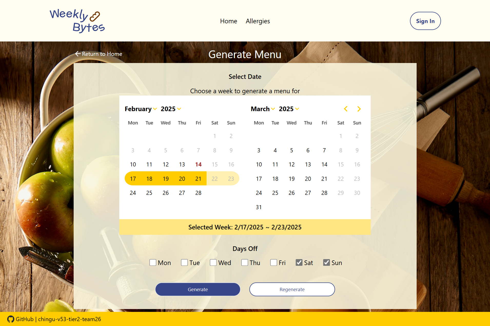
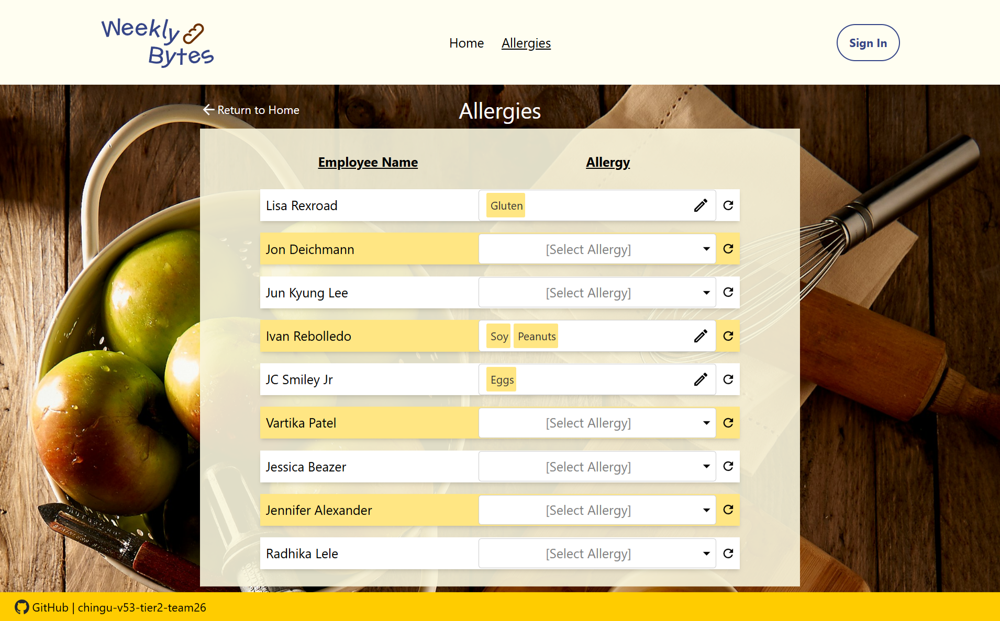

# Weekly Bytes

## Overview
**Weekly Bytes is an intuitive web application designed to help managers effortlessly create and share weekly meal plans while prioritizing staff safety and dietary needs.** With a vast selection of delicious meals, the app automatically filters out any dishes containing allergens identified by staff members. It then generates a randomized menu—ensuring variety and eliminating meal repetition within the same week. 

Say goodbye to the hassle of meal planning and hello to a seamless, allergy-conscious dining experience for your team!

## Visuals
### Landing Page

### Weekly Meal Planner

### List Employee Allergies

## Features
- **Effortless Weekly Meal Planning** – Quick weekly meal plan creation via a Generate & Regenerate buttons
- **Allergy-Conscious Filtering** – Allows assigning identified allergies to staff members
- **Extensive Meal Selection** – Access a diverse and extensive menu of meals from an API.
- **Smart Meal Randomization** – Ensures no meal is repeated within the same week.
- **User-Friendly Interface** – Simple intuitive design for choosing which week to meal plan and assigning off days.
- **Documentation Download** – One-click downloading of PDF of allergies and weekly meals plan

## Live Version
***Site:*** https://weekly-bytes.com/

#### <ins>Sign-in Credentials<ins>
**Email:** manager@company.com 

**Password:** password123

## Running The Project Locally
1. Clone this project locally
2. Open a terminal and CD into the directory with the repository
3. In the terminal, type "npm install"
4. Once installed, type "npm run dev" to run the project.
5. You should be able to see the locally hosted site at http://localhost:5173/. 

## Dev Dependencies
* Vite
* React
* Emotion 
* Material UI Icons 
* Firebase 
* Date-Fns 
* JSPDF
* Moment
* React-Toastify
* UUID
* React-Select
* React-Router

## Our Team
- Lisa Rexroad (Primary Scrum Master): [GitHub](https://github.com/lrexroad) / [LinkedIn](https://www.linkedin.com/in/lisa-rexroad-csm-sa-ccmp-b556511b/)
- Jon Deichmann (Developer): [GitHub](https://github.com/jcad57?tab=repositories) / [LinkedIn](https://www.linkedin.com/in/jon-deichmann/)
- Jun Kyung Lee (Developer): [GitHub](https://github.com/junlee0325) / [LinkedIn](https://www.linkedin.com/in/iam-junkyunglee/)
- Ivan Rebolledo Chavez (Developer): [GitHub](https://github.com/ivannissimrch) / [LinkedIn](https://www.linkedin.com/in/ivan-rebolledo-012b17244/)
- JC Smiley Jr. (Developer)): [GitHub](https://github.com/jcsmileyjr) / [LinkedIn](https://www.linkedin.com/in/jcsmileyjr/)
- Vartika Patel (UX Designer): [GitHub](https://github.com/vartika99) / [LinkedIn](https://www.linkedin.com/in/vartikapatel/)
- Jessica Beazer(Product Owner): [GitHub](https://github.com/jessanagilepmp) / [LinkedIn](https://linkedin.com/in/jessicabeazer)
- Jennifer Alexander1 (Voyage Guide): [GitHub](https://github.com/jenny-alexander) / [LinkedIn](https://linkedin.com/in/jenny-alexander)
- Radhika Lele (Junior Developer) : [GitHub](https://github.com/Radhika-Lele) / [LinkedIn](https://www.linkedin.com/in/radhika-lele)
